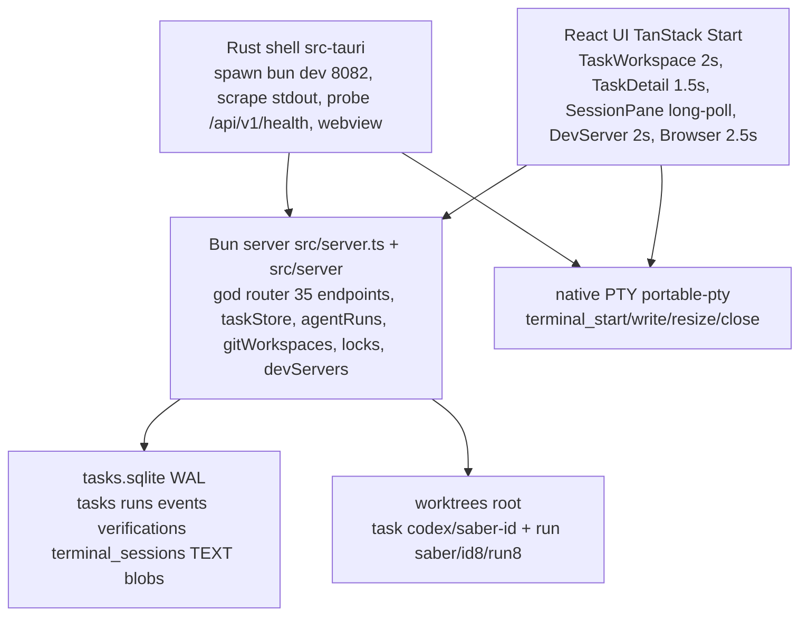

# C4 Level 2 — Saber containers

```mermaid
flowchart TB
  SHELL["Rust shell src-tauri<br/>spawn bun dev 8082, scrape stdout, probe /api/v1/health, webview"]
  SERVER["Bun server src/server.ts + src/server<br/>god router 35 endpoints, taskStore, agentRuns, gitWorkspaces, locks, devServers"]
  UI["React UI TanStack Start<br/>TaskWorkspace 2s, TaskDetail 1.5s, SessionPane long-poll, DevServer 2s, Browser 2.5s"]
  DB["tasks.sqlite WAL<br/>tasks runs events verifications terminal_sessions TEXT blobs"]
  WT["worktrees root<br/>task codex/saber-id + run saber/id8/run8"]
  PTY["native PTY portable-pty<br/>terminal_start/write/resize/close"]
  SHELL --> SERVER
  SERVER --> DB
  SERVER --> WT
  UI --> SERVER
  UI --> PTY
  SHELL --> PTY
```

Up: [context](./c4-context.md). Next: [components](./c4-components.md). Map: [codebase map](./codebase-map.md).
