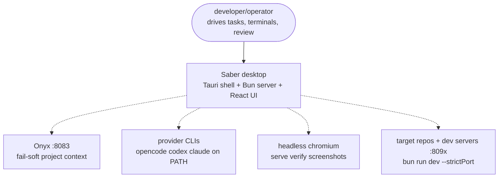

# C4 Level 1 — Saber context

```mermaid
flowchart TB
  USER(["developer/operator<br/>drives tasks, terminals, review"])
  SABER["Saber desktop<br/>Tauri shell + Bun server + React UI"]
  ONYX["Onyx :8083<br/>fail-soft project context"]
  CLIS["provider CLIs<br/>opencode codex claude on PATH"]
  CHROM["headless chromium<br/>serve verify screenshots"]
  DEVS["target repos + dev servers :809x<br/>bun run dev --strictPort"]
  USER --> SABER
  SABER -.-> ONYX
  SABER -.-> CLIS
  SABER -.-> CHROM
  SABER -.-> DEVS
```

Up: [codebase map](./codebase-map.md). Next: [containers](./c4-containers.md).
