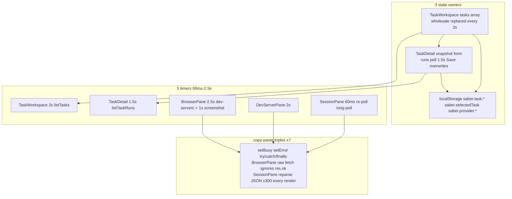

# Zoom — Frontend

```mermaid
flowchart TB
  subgraph OWNERS["3 state owners"]
    TW["TaskWorkspace tasks array<br/>wholesale replaced every 2s"]
    TD["TaskDetail snapshot form<br/>runs poll 1.5s Save overwrites"]
    LS["localStorage saber.task.* saber.selectedTask saber.provider.*"]
  end
  subgraph TIMERS["5 timers 60ms-2.5s"]
    T1["TaskWorkspace 2s listTasks"]
    T2["TaskDetail 1.5s listTaskRuns"]
    T3["SessionPane 60ms re-poll long-poll"]
    T4["DevServerPane 2s"]
    T5["BrowserPane 2.5s dev-servers + 1s screenshot"]
  end
  subgraph DUP["copy-paste triples x7"]
    TRIPLE["setBusy setError try/catch/finally<br/>BrowserPane raw fetch ignores res.ok<br/>SessionPane reparse JSON x300 every render"]
  end
  TW --> TD
  TW --> LS
  TD --> LS
  TW --> T1
  TD --> T2
  T3 --> TRIPLE
  T4 --> TRIPLE
  T5 --> TRIPLE
```

Map: [codebase map](./codebase-map.md).
