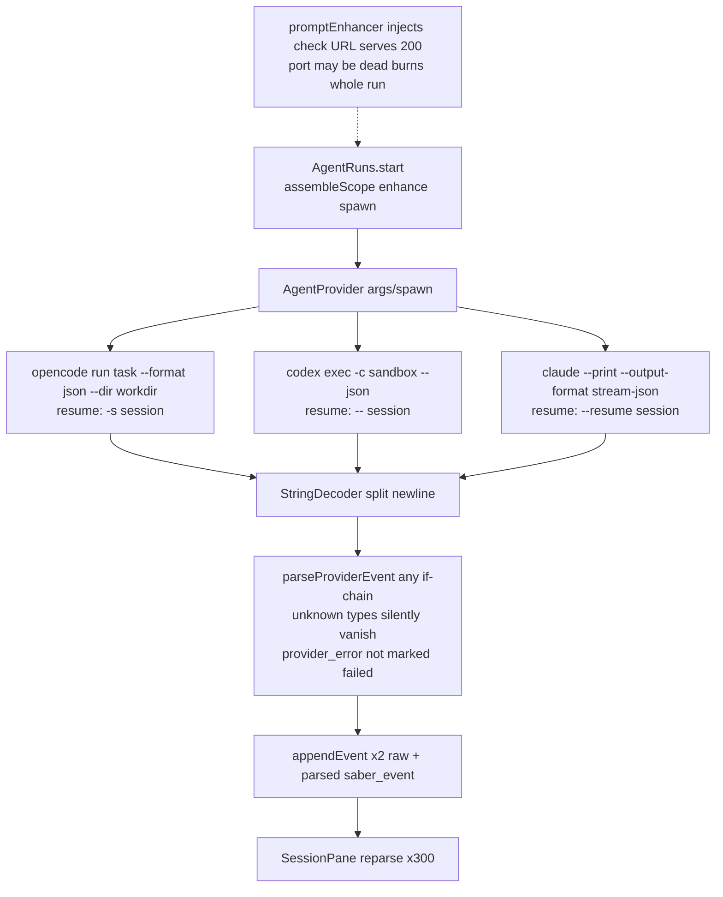

# Zoom — Providers

```mermaid
flowchart TB
  AG["AgentRuns.start<br/>assembleScope enhance spawn"] --> AD["AgentProvider args/spawn"]
  AD --> OC["opencode run task --format json --dir workdir<br/>resume: -s session"]
  AD --> CX["codex exec -c sandbox --json<br/>resume: -- session"]
  AD --> CL["claude --print --output-format stream-json<br/>resume: --resume session"]
  OC --> DEC["StringDecoder split newline"]
  CX --> DEC
  CL --> DEC
  DEC --> PAR["parseProviderEvent any if-chain<br/>unknown types silently vanish<br/>provider_error not marked failed"]
  PAR --> EV["appendEvent x2 raw + parsed saber_event"]
  EV --> SP["SessionPane reparse x300"]
  PROBE["promptEnhancer injects check URL serves 200<br/>port may be dead burns whole run"] -.-> AG
```

Map: [codebase map](./codebase-map.md).
