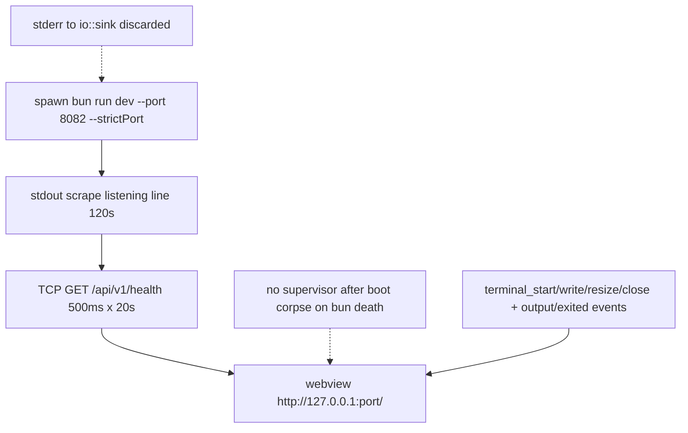

# Zoom — Rust shell

```mermaid
flowchart TB
  SP["spawn bun run dev --port 8082 --strictPort"] --> SC["stdout scrape listening line 120s"]
  SC --> HP["TCP GET /api/v1/health 500ms x 20s"]
  HP --> WV["webview http://127.0.0.1:port/"]
  SE["stderr to io::sink discarded"] -.-> SP
  NS["no supervisor after boot corpse on bun death"] -.-> WV
  PT["terminal_start/write/resize/close + output/exited events"] --> WV
```

Map: [codebase map](./codebase-map.md).
