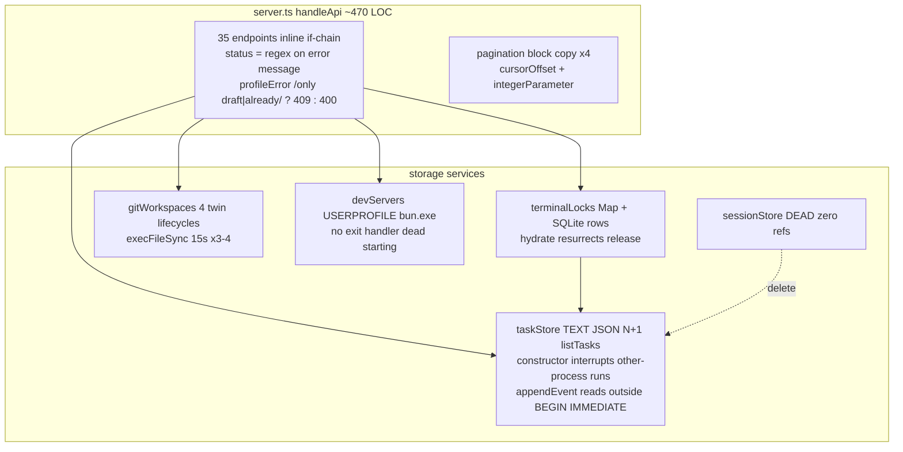

# Zoom — Bun server

```mermaid
flowchart TB
  subgraph ROUTES["server.ts handleApi ~470 LOC"]
    GOD["35 endpoints inline if-chain<br/>status = regex on error message<br/>profileError /only draft|already/ ? 409 : 400"]
    PAG["pagination block copy x4<br/>cursorOffset + integerParameter"]
  end
  subgraph STORE["storage services"]
    TS["taskStore TEXT JSON N+1 listTasks<br/>constructor interrupts other-process runs<br/>appendEvent reads outside BEGIN IMMEDIATE"]
    LOCKS["terminalLocks Map + SQLite rows<br/>hydrate resurrects release"]
    GW["gitWorkspaces 4 twin lifecycles<br/>execFileSync 15s x3-4"]
    DS["devServers USERPROFILE bun.exe<br/>no exit handler dead starting"]
    SS["sessionStore DEAD zero refs"]
  end
  GOD --> TS
  GOD --> LOCKS
  GOD --> GW
  GOD --> DS
  LOCKS --> TS
  SS -.->|"delete"| TS
```

Map: [codebase map](./codebase-map.md).
